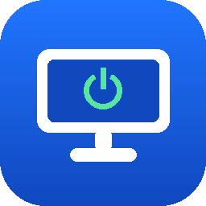

<div align="center">



# PC MATE

**Компьютер готов к вашему приходу.**

Включение, выключение, сон и сценарии на домашнем ПК — с телефона, из любой точки.

</div>

---

## Что это

PC MATE — это четыре части, которые работают вместе:

| Часть | Где живёт | Что делает |
|---|---|---|
| **Агент** | Windows 10/11 | Служба + помощник в трее: команды питания, сценарии, таймеры пробуждения, мастер готовности |
| **Приложение** | Android 8+ (iOS — второй этап) | Пульт: статус, кнопки, сценарии, расписания, «буду через N минут» |
| **Сервер-ретранслятор** | Linux VPS в Docker | Передаёт зашифрованные команды между телефоном и ПК. Портов на домашнем роутере открывать не нужно |
| **Мост пробуждения** | ESP32 или Raspberry Pi | Всегда включён дома и по команде будит компьютер магическим пакетом |

---

## Главное ограничение, о котором нужно знать сразу

**Выключенный компьютер не может принять команду из интернета.** Агент не
работает, сеть почти обесточена. Жива только сетевая карта, и она слушает
единственную вещь — «магический пакет» Wake-on-LAN, который не выходит за
пределы локальной сети.

Поэтому включение сделано двумя независимыми способами:

1. **Таймер пробуждения Windows** — агент заранее, пока ПК работает, заводит
   задачу в Планировщике с флагом «пробуждать компьютер». Работает из сна (S3) и
   гибернации (S4), **сеть не нужна вообще**. Это основной способ для расписаний.
2. **Wake-on-LAN** — магический пакет отправляет устройство из той же сети:
   телефон (если он дома в Wi-Fi) или мост пробуждения (если вас нет дома).

Отсюда рекомендации:

* держите ПК в **гибернации**, а не выключенным — из неё он просыпается надёжнее
  и сохраняет открытые программы;
* подключите ПК **кабелем**: Wake-on-WLAN на настольных машинах почти не работает;
* для включения «из любой точки мира» нужен **мост** — иначе телефону некуда
  отправить пакет.

Всё это проверяет встроенный мастер готовности — он же почти всё и чинит сам.

---

## Установка

Готовые файлы — на странице [**Releases**](../../releases/latest). Магазины
приложений не используются: всё раздаётся отсюда.

### 1. Компьютер (Windows 10/11)

Скачайте **`PcMate-Setup-X.Y.Z.exe`** и запустите. Установщик сам поставит
службу, добавит правило брандмауэра, включит гибернацию и таймеры пробуждения,
а при отсутствии .NET 8 Desktop Runtime загрузит его с сайта Microsoft.

> Windows SmartScreen предупредит о неизвестном издателе: установщик не подписан
> сертификатом (он стоит ~15 000 ₽ в год). Нажмите «Подробнее» → «Выполнить в
> любом случае». Чтобы убедиться, что файл не подменили, сверьте SHA-256 из
> заметок к выпуску:
> ```powershell
> Get-FileHash .\PcMate-Setup-1.0.0.exe -Algorithm SHA256
> ```

После установки откроется окно с QR-кодом и мастер готовности.

### 2. Телефон (Android 8+)

Скачайте **`PcMate-X.Y.Z.apk`** и откройте его. Android попросит разрешить
установку из этого источника — это обычное дело для приложений не из магазина.

Отсканируйте QR-код с экрана компьютера. Телефон и ПК обменяются ключами и
покажут одинаковый отпечаток — сверьте его.

**Этого уже достаточно**, чтобы из домашнего Wi-Fi включать, выключать и
усыплять компьютер и запускать сценарии.

Обновления приложение и агент проверяют сами раз в сутки и предлагают скачать
новую версию — автоматических обновлений вне магазина не бывает.

### Сборка из исходников

```powershell
cd agent
./build.ps1              # служба, трей и установщик в agent/dist
./install.ps1            # установка без установщика, из PowerShell от администратора
```

```bash
cd mobile
npm install
npx expo run:android     # Wake-on-LAN требует обычной сборки, в Expo Go не работает
```

## Дальше по желанию

### 3. Сервер (для управления не из дома)

```bash
cd server
cp .env.example .env      # впишите свой домен
docker compose up -d
```

Затем в трее на компьютере: **Настройки → Сервер-ретранслятор** → адрес вида
`wss://relay.example.com`.

### 4. Мост (для включения не из дома)

```bash
# Raspberry Pi или любой всегда включённый Linux
cd bridge/linux
sudo ./install.sh wss://relay.example.com <идентификатор ПК>
```

Идентификатор ПК показан в приложении: **Ещё → Диагностика**.

Для ESP32 (~500 ₽): `cd bridge/esp32 && pio run -t upload`, затем подключиться к
точке доступа «PC MATE Bridge» и указать Wi-Fi, адрес сервера и идентификатор ПК.

---

## Что умеет

**Питание.** Выключить, перезагрузить, сон, гибернация, блокировка, отмена.
Перед выключением на ПК появляется окно с обратным отсчётом и кнопкой «Отмена» —
команда с телефона не застаёт врасплох.

**Сценарии.** Цепочки действий: запустить программу, открыть файл или сайт,
закрыть процесс, пауза, громкость, действие питания, уведомление на телефон.
Список установленных программ телефон запрашивает у компьютера — путь вручную
вводить не нужно. Каждый шаг возвращает статус, итоговый отчёт приходит на телефон.

**Расписания.** «Пн–Пт в 23:00 включить и запустить сценарий „Вечер“»,
«ежедневно в 03:00 гибернация». События «включить» превращаются в задачи
Планировщика Windows и работают, даже если сервер недоступен.

**«Буду через N минут».** Компьютер проснётся и подготовится к вашему приходу.

**Мастер готовности.** 12 проверок (гибернация, режимы сна, таймеры пробуждения,
быстрый запуск, пробуждение сетевой карты, магический пакет, кабель, MAC и IP,
постоянный адрес, BIOS, связь с сервером, автовход) — с кнопкой «Исправить»
там, где это можно сделать автоматически, и пошаговой инструкцией там, где нельзя.

**Тестовое пробуждение.** ПК уходит в сон на две минуты, затем его будят
таймером или магическим пакетом — и агент честно сообщает, сработало ли.

---

## Безопасность

* Сквозное шифрование **X25519 → HKDF-SHA256 → AES-256-GCM**. Ключи рождаются
  при сопряжении; сервер видит только маршрутные поля и переслать чужую команду
  не может.
* Каждая команда несёт **временную метку и nonce**: перехваченную команду
  нельзя повторить.
* Маршрутные поля входят в **AAD** — сервер не может подменить получателя,
  не сломав проверку подлинности.
* На компьютере **нет открытых входящих портов** для интернета: агент сам
  подключается к серверу исходящим соединением.
* Ключи на ПК защищены **DPAPI**, на телефоне — **Keystore/Keychain**.
* Выполнение произвольных команд (cmd/PowerShell) **выключено по умолчанию** и
  включается только на самом компьютере.
* PC MATE **не хранит и не спрашивает пароль Windows**. Автовход — отдельная
  ручная настройка с предупреждением.

Подробности — в [docs/security.md](docs/security.md).

---

## Структура репозитория

```
PcMATE/
├── agent/            Агент для Windows (C# / .NET 8)
│   ├── src/PcMate.Core            протокол, криптография, модели
│   ├── src/PcMate.Agent.Service   служба: питание, расписания, сеть
│   ├── src/PcMate.Agent.Tray      помощник в трее: QR, мастер, отсчёт
│   ├── tests/                     модульные тесты и векторы совместимости
│   └── installer/                 Inno Setup
├── server/           Сервер-ретранслятор (Node.js + TypeScript + SQLite)
├── mobile/           Приложение (React Native / Expo)
├── bridge/
│   ├── esp32/        Прошивка моста (PlatformIO)
│   └── linux/        Мост для Raspberry Pi (Python + systemd)
├── docs/             Протокол, архитектура, безопасность, инструкции
└── tools/            Генератор иконок и тестовых векторов
```

---

## Разработка

```bash
# Агент
cd agent && dotnet build PcMate.sln && dotnet test

# Сервер
cd server && npm install && npm test && npm run typecheck

# Приложение
cd mobile && npm install && npm test && npm run typecheck

# Пересобрать векторы совместимости протокола
node tools/gen-test-vectors.mjs
```

Три реализации протокола (C#, TypeScript, Python) сверяются с общими
[тестовыми векторами](docs/test-vectors.json), которые считает независимая
реализация на `node:crypto`. Если агент и приложение сходятся на них — они
поймут друг друга.

---

## Документация

* [Протокол v1](docs/protocol.md) — контракт всех четырёх компонентов
* [Архитектура](docs/architecture.md) — как части устроены и почему именно так
* [Безопасность](docs/security.md) — модель угроз и решения
* [Инструкция пользователя](docs/setup-guide.md) — от установки до первого включения
* [Выпуск версии](docs/release.md) — сборка установщика и APK, подпись, обновления
* [Дорожная карта](docs/roadmap.md) — что сделано и что дальше
* [Решение проблем](docs/troubleshooting.md) — если компьютер не просыпается
* [Состояние проекта](docs/handover.md) — что готово и что осталось

---

## Лицензия

MIT — см. [LICENSE](LICENSE).
